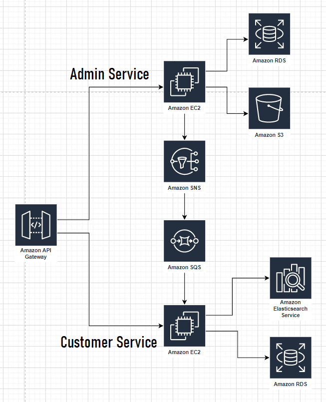
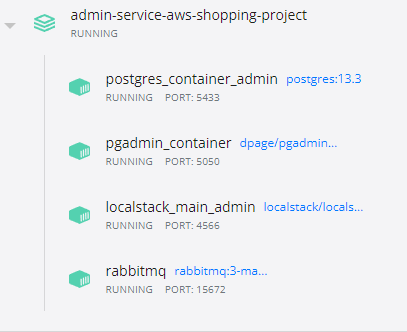

#AWS Shopping Service Project

Welcome to AWS Shopping Service Project! This project is designed to launch an online store system on AWS services. The project consists of two microservices: admin service and customer service. This module represents admin service.

#Admin service
The admin service is designed to manage the objects of the online store (adding, deleting, updating the assortment). The service provides an entrance to the administrator account for the implementation of the above functions.

SWAGGER API for admin service described on **AdminServiceSwagger** at the root of project

#Interaction Scheme

#Getting started with Admin service of AWS Shopping Service Project
- Install Java 11
  For Windows: https://www.oracle.com/technetwork/java/javase/downloads/jdk8-downloads-2133151.html
  Add bin files to environment variable PATH
  For UNIX: https://openjdk.java.net/install/
- Install git: https://git-scm.com/downloads
- Install Docker https://docs.docker.com/desktop/windows/install/
- Read about AWS services: S3, SNS, SQS, RDS, EC2 https://docs.aws.amazon.com/index.html?nc2=h_ql_doc_do

#How to run the Admin service locally
After completing the previous steps:
1. Clone repository
2. Run services in docker containers via docker-compose:
- Run ***docker-compose up*** in Admin-Service-AWS-Shopping-Project folder. It will start RabbitMq, S3 service, postgres and pgadmin in containers.

The started services in docker desktop should look like this:

Available addresses for interaction: 

| Services  | Addresses  |
| ------------- | -------------        |
| RabbitMq  | http://localhost:15672  |
| PgAdmin Admin  | http://localhost:5050  |
| Localstack(S3)  | http://localhost:4566  |

3. Set environment variables:
- spring.datasource.username=user;
- spring.datasource.password=pass;
- spring.profiles.active=local;
4. The project can be started!
